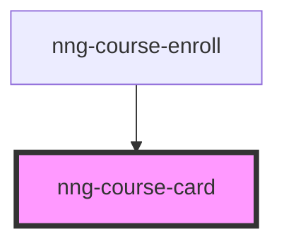

# nng-course-card

<!-- Auto Generated Below -->

## Properties

| Property   | Attribute  | Description | Type      | Default     |
| ---------- | ---------- | ----------- | --------- | ----------- |
| `course`   | `course`   |             | `any`     | `undefined` |
| `required` | `required` |             | `boolean` | `undefined` |

## Dependencies

### Used by

 - [nng-course-enroll](../nng-course-enroll)

### Graph

----------------------------------------------

*Built with [StencilJS](https://stenciljs.com/)*
